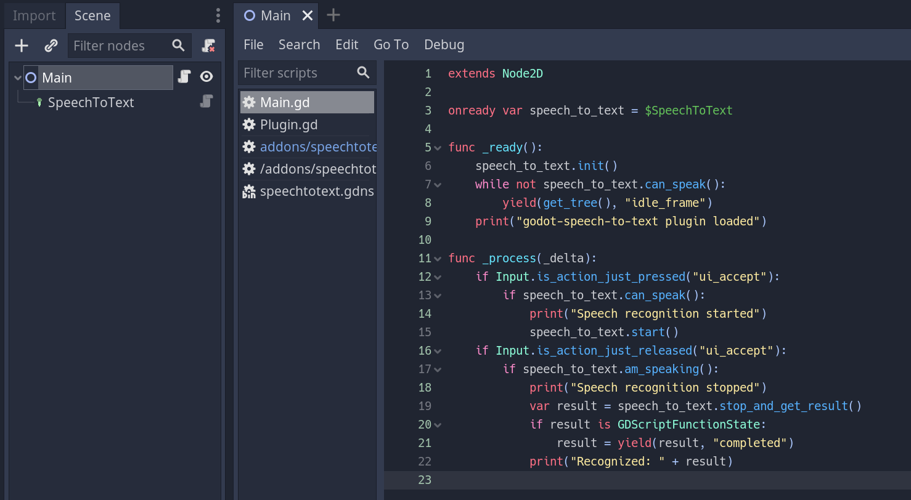

# Godot Speech to Text

Godot Speech to Text is a plugin that enables speech-to-text voice recognition in the Godot engine for Windows and Linux (x86_64). The FOSS Pocketsphinx and Sphinxbase libraries were used for this project.

This plugin was originally developed for use in [Strange Aeons](https://store.steampowered.com/app/1290960/Strange_Aeons), a game where you chat with a neural net AI.

## Instructions

Once the plugin is installed and enabled the node type **SpeechToText** should appear in the Godot engine. Add it to your scene and use the example below as a guideline.

## Example

In the example project shown below the player has to hold SPACE and speak into the microphone. Recognized text is printed in the output once the button is released.



```
extends Node2D

onready var speech_to_text = $SpeechToText

func _ready():
    speech_to_text.init()
    while not speech_to_text.can_speak():
        yield(get_tree(), "idle_frame")
    print("godot-speech-to-text plugin loaded")

func _process(_delta):
    if Input.is_action_just_pressed("ui_accept"):
        if speech_to_text.can_speak():
            print("Speech recognition started")
            speech_to_text.start()
    if Input.is_action_just_released("ui_accept"):
        if speech_to_text.am_speaking():
            print("Speech recognition stopped")
            var result = speech_to_text.stop_and_get_result()
            if result is GDScriptFunctionState:
                result = yield(result, "completed")
            print("Recognized: " + result)

```

## Compilation instructions

Linux:

- Run `make` in the src directory

Windows:

- Install MinGW-w64 on your system
- Run `mingw32-make` in the src directory

## Known issues

- Freezing if the game is quit while speech to text is being initialized or speech is recognized. This can be worked around by custom handling of quitting (e.g., `if speech_to_text.can_speak(): get_tree().quit()`)
- MacOS is currently not supported
- The directory **addons/speechtotext/model** and all its contents have to be copied to the exported game's root folder manually
